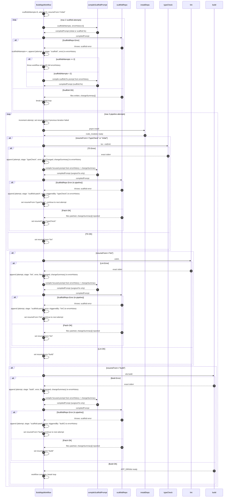

# Temporal Build Pipeline — Agent Prompt

## AGENT PREAMBLE — READ FIRST

You are operating in OpenCode/Claude Code CLI. Before writing any code:

> **APP_DIR = `D:\xxx\app-chat`**
> THIS IS THE ONLY PLACE YOU SET THE PATH. Replace `xxx` with your actual project folder name (e.g. `D:\my-chatbot\app-chat`). Every activity, every `cd`, every `cwd` reference uses this variable. Never hardcode the path anywhere else.

1. Confirm Temporal dev server is running at `localhost:7233`. If not, tell user: *"Run `temporal.exe server start-dev` in a separate terminal first."*
2. Work in the current directory. Do not change drives or folders unless user specifies.
3. Create all files from scratch. Assume zero existing project files.
4. After creating `worker.ts`, `activities.ts`, `workflows/build-app.ts`, run `pnpm start`.
5. Do not ask for clarification. Begin immediately.

**Objective:** Build a TypeScript app using Temporal to orchestrate the entire build pipeline. Temporal owns all durable state. The agent receives a short, compiled, targeted prompt per retry — never a raw error transcript.

---

## App Spec

```
{Describe your app here. Example: "Vite + React + TypeScript chatbot. Backend: Supabase. Inference: OpenAI API."
The folder is always APP_DIR as defined above — no need to repeat it here.}
```

---

## Workflow Spec



---

## Requirements

### 1. Workflow (`workflows/build-app.ts`)

Maintain this state throughout the workflow:

```typescript
interface ErrorEntry {
  attempt: number;
  stage: "scaffold" | "scaffold-patch" | "typeCheck" | "lint" | "build";
  error: string;             // exact, untruncated stderr
  filesChanged?: string[];   // files touched by the patch
  changeSummary?: string[];  // what actually changed inside those files
  triggeredBy?: string;      // for scaffold-patch: which stage caused it
}

let scaffoldAttempts = 0;
let attempt = 0;
let resumeFrom: "initial" | "typeCheck" | "lint" | "build" = "initial";
let errorHistory: ErrorEntry[] = [];
```

**Rules:**

- `scaffoldAttempts` tracks only the initial scaffold loop. Max 2. Throws with full `errorHistory` if exceeded.
- `attempt` tracks pipeline loop iterations. Max 3. Increments at the top of each pipeline loop iteration.
- `resumeFrom` determines which stage the pipeline resumes from. Never resets to `"initial"` inside the pipeline loop — only advances or stays.
- On every `scaffoldRepo` call anywhere in the workflow, first call `compileScaffoldPrompt(spec, errorHistory, attempt, resumeFrom)` and pass its output as the prompt. Never pass raw `errorHistory` directly to any activity.
- If pipeline attempts exhausted, throw a workflow error listing every `ErrorEntry` in `errorHistory`.

> **CRITICAL — Workflow definition pattern:** Workflows are exported async functions, NOT classes or `defineWorkflow` calls (that API does not exist). Use:

```typescript
export async function buildAppWorkflow(spec: string): Promise<string> { ... }
```

The worker references it by string name: `client.start("buildAppWorkflow", { ... })`.

> **CRITICAL — Throwing workflow errors:** Use `ApplicationFailure.create({ message, type })` from `@temporalio/workflow`, NOT `WorkflowError` (which does not exist as a throwable class in the SDK).

```typescript
import { ApplicationFailure } from "@temporalio/workflow";
throw ApplicationFailure.create({ message: "Scaffold failed", type: "ScaffoldFailed" });
```

---

### 2. `compileScaffoldPrompt` — pure workflow-side function (not an activity)

```typescript
function compileScaffoldPrompt(
  spec: string,
  errorHistory: ErrorEntry[],
  attempt: number,
  resumeFrom: string
): string {

  // Mode A: initial scaffold
  if (errorHistory.length === 0) {
    return `
You are scaffolding a new app from scratch.
Spec: ${spec}
Requirements:
- Vite + React + TypeScript
- Create eslint.config.js with sensible flat config defaults
- All files must compile cleanly with tsc --noEmit and eslint
Return: a list of every file you created and a one-line summary of what each does.
    `.trim();
  }

  // Mode B: surgical patch
  const latest = errorHistory[errorHistory.length - 1];
  const previousFixes = errorHistory.slice(0, -1).map(e =>
    `  Attempt ${e.attempt} | ${e.stage}${e.triggeredBy ? ` (fixing ${e.triggeredBy})` : ""}:
     Files changed: ${(e.filesChanged || []).join(", ")}
     What changed: ${(e.changeSummary || []).join("; ")}`
  ).join("\n");

  return `
You are making a surgical fix to an existing app.
Spec: ${spec}

Current error to fix (fix this and only this):
  Stage: ${latest.stage}${latest.triggeredBy ? ` (triggered by ${latest.triggeredBy})` : ""}
  Error: ${latest.error}

What was already tried — do NOT repeat these:
${previousFixes || "  Nothing tried yet."}

Rules:
- Fix only the file(s) causing the current error above.
- Do not touch unrelated files.
- Do not repeat a fix already listed above.
- Return the exact list of files you changed and a one-line summary of what you changed in each.
  `.trim();
}
```

---

### 3. Activities (`activities.ts`)

```typescript
scaffoldRepo(compiledPrompt: string): Promise<{
  filesChanged: string[];
  changeSummary: string[];
}>
// Executes the compiled prompt via the agent.
// Returns list of files written/modified + one-line summary per file.
// scheduleToCloseTimeout: 10 minutes

installDeps(): Promise<void>
// Runs: pnpm install inside APP_DIR
// scheduleToCloseTimeout: 10 minutes

typeCheck(): Promise<{ ok: boolean; error?: string }>
// Runs: tsc --noEmit inside APP_DIR
// Captures full stderr. Never truncate.
// scheduleToCloseTimeout: 10 minutes

lint(): Promise<{ ok: boolean; error?: string }>
// Runs: eslint . inside APP_DIR
// Captures full stderr. Never truncate.
// scheduleToCloseTimeout: 10 minutes

build(): Promise<{ ok: boolean; error?: string; distPath?: string }>
// Runs: vite build inside APP_DIR
// Captures full stderr. Never truncate.
// scheduleToCloseTimeout: 10 minutes
```

All activities must capture raw `stdout + stderr` combined. No summarizing. No truncating.

> **⚠️ LEARNED — Activity timeouts:** The original 2-3 minute timeouts are too aggressive. `pnpm install` can take 30-60s on first run, and `vite build` with cold caches can exceed 3 minutes. In `proxyActivities`, set both `startToCloseTimeout` and `scheduleToCloseTimeout` to 10 minutes for all activities.

> **⚠️ LEARNED — APP_DIR path:** Always use the APP_DIR value defined at the very top of this prompt. Define it as a constant at the top of `activities.ts`:

```typescript
const APP_DIR = "D:\\xxx\\app-chat"; // match exactly what's set in the preamble
```

In all `child_process.exec` calls, pass `{ cwd: APP_DIR }`.

> **⚠️ LEARNED — pnpm install and esbuild:** pnpm 10+ blocks build scripts by default (including esbuild's postinstall). Without the esbuild binary, `vite build` will fail. Add to the scaffolded `package.json`:

```json
"pnpm": { "onlyBuiltDependencies": ["esbuild"] }
```

And add to `devDependencies`:

```json
"@esbuild/win32-x64": "^0.25.0"
```

Alternatively, in the `installDeps` activity, run:

```bash
pnpm config set onlyBuiltDependencies "esbuild" --location project && pnpm install --force
```

> **⚠️ LEARNED — Use `pnpm install --force`** in installDeps activity to ensure dependencies are actually installed on each pipeline retry, not just "Lockfile is up to date" skipped install.

> **⚠️ LEARNED — eslint.config.js dependencies:** The initial scaffold must include ALL ESLint plugin packages in `package.json` that `eslint.config.js` imports. Include these in `devDependencies` from the start:

```json
"eslint-plugin-react-hooks": "^5.0.0",
"eslint-plugin-react-refresh": "^0.4.14",
"globals": "^15.12.0"
```

> **⚠️ LEARNED — Vite 6+ build script:** Use `"build": "tsc -b && vite build"` (not `tsc && vite build`). The `-b` flag is the project-references-aware build mode in TypeScript 5.6+.

---

### 4. Worker (`worker.ts`)

- Register all activities and `buildAppWorkflow`.
- After worker starts, automatically trigger `buildAppWorkflow` with the app spec as input.
- On each retry, log to console:

```
[Attempt N | stage] Error: <first 300 chars of error>
[Attempt N | stage] Compiled prompt: <full compiledPrompt>
[Attempt N | stage] Files changed: <filesChanged[]>
[Attempt N | stage] Change summary: <changeSummary[]>
[Attempt N | stage] resumeFrom: <resumeFrom>
```

This gives full visibility without bloating agent context.

> **⚠️ LEARNED — Worker connection retry:** The Temporal dev server takes several seconds to become ready. The native Rust core-bridge inside `Worker.create()` does NOT retry — if the server isn't ready, it throws `TransportError` immediately. Add a pre-flight health check before calling `Worker.create()`:

```typescript
import { Connection } from "@temporalio/client";

async function waitForServer(maxRetries = 10, delayMs = 3000): Promise<void> {
  for (let i = 0; i < maxRetries; i++) {
    try {
      const conn = await Connection.connect({ address: "localhost:7233" });
      await conn.workflowService.listNamespaces({});
      conn.close();
      console.log("Connected to Temporal server!");
      return;
    } catch {
      console.log(`Waiting for server... (attempt ${i + 1}/${maxRetries})`);
      await new Promise(r => setTimeout(r, delayMs));
    }
  }
  throw new Error("Could not connect to Temporal server");
}
```

Call `await waitForServer()` BEFORE `Worker.create()`.

> **⚠️ LEARNED — Workflow name in client.start:** Use the string name of the function, not the function reference:

```typescript
const handle = await client.start("buildAppWorkflow", { ... });
```

> **⚠️ LEARNED — @temporalio/core-bridge must be explicitly installed:**

```bash
pnpm add @temporalio/core-bridge
```

Verify the native binary exists at: `node_modules/@temporalio/core-bridge/releases/x86_64-pc-windows-msvc/index.node`

> **⚠️ LEARNED — @swc/core platform binary:** Install the Windows binary explicitly:

```bash
pnpm add @swc/core-win32-x64-msvc
```

---

### 5. ESLint — scaffold on attempt 0

- `scaffoldRepo` must emit `eslint.config.js` (flat config) on the initial scaffold.
- The `eslint.config.js` must only import packages listed in `package.json` devDependencies.
- Include all ESLint plugin dependencies in the initial scaffold's `package.json` — the retry loop is a safety net, not the primary path.

---

### 6. `resumeFrom` State Machine — implement exactly as follows

```typescript
// At top of pipeline loop:
attempt++;

// After typeCheck passes:
resumeFrom = "lint";

// After typeCheck fails and patch applied (or patch fails):
resumeFrom = "typeCheck"; // stays, resumes here next iteration

// After lint passes:
resumeFrom = "build";

// After lint fails and patch applied (or patch fails):
resumeFrom = "lint"; // stays

// After build fails and patch applied (or patch fails):
resumeFrom = "build"; // stays

// After build succeeds:
// break loop, return distPath
```

---

### 7. General Rules

- Do NOT start a dev server inside Temporal.
- Workflow ends when `vite build` succeeds — return `APP_DIR\dist`.
- All activity timeouts set explicitly. No implicit defaults. Use 10 minutes for `scheduleToCloseTimeout` and `startToCloseTimeout` on all `proxyActivities`.
- `compileScaffoldPrompt` is the only place that constructs agent prompts. Workflow code never passes raw `errorHistory` to any activity.
- Every `scaffoldRepo` call in the pipeline — whether triggered by `typeCheck`, `lint`, or `build` failure — must have its own `alt ScaffoldRepo Error` handler as shown in the diagram.

---

### 8. Setup & Dependency Installation (Windows)

> **⚠️ LEARNED — Full dependency list:** Running the basic Temporal SDK install is NOT sufficient. You MUST also install the native bridge packages explicitly:

```bash
# Core Temporal SDK packages
pnpm add @temporalio/workflow @temporalio/activity @temporalio/worker @temporalio/client

# Native bridge (required — worker will crash without it)
pnpm add @temporalio/core-bridge

# SWC compiler platform binary (required for worker workflow bundling)
pnpm add @swc/core-win32-x64-msvc

# TypeScript and runner
pnpm add -D typescript tsx @types/node
```

> **⚠️ LEARNED — Temporal CLI on Windows:** Download from https://github.com/temporalio/cli/releases — grab `temporal_cli_X.X.X_windows_amd64.zip`, extract `temporal.exe`, and add it to your PATH. Start the dev server:

```bash
temporal.exe server start-dev
```

Use `--headless` to skip the UI if not needed (saves ~40MB RAM):

```bash
temporal.exe server start-dev --headless
```

> **⚠️ LEARNED — Server startup timing:** The Temporal dev server takes 5-10 seconds to become ready after printing `"Temporal Server: localhost:7233"`. The message is printed before the gRPC endpoint is actually listening. Always implement the `waitForServer()` retry loop described in section 4.

---

### 9. Failure Learnings Summary

| # | Failure | Root Cause | Fix |
|---|---------|------------|-----|
| 1 | `TransportError: Connection refused` when worker starts | Server not ready yet, or server crashed | Add `waitForServer()` pre-flight check using `@temporalio/client` `Connection.connect()` before `Worker.create()` |
| 2 | `Worker.create()` throws `TransportError` even after server is confirmed running | Missing `@temporalio/core-bridge` native binary | `pnpm add @temporalio/core-bridge` explicitly — check `releases/` folder has `x86_64-pc-windows-msvc/index.node` |
| 3 | `Permission denied, mkdir 'D:\app-chat'` | Path not writable or doesn't exist | Use `D:\xxx\app-chat` where xxx is your actual project folder — set APP_DIR at top of `activities.ts` |
| 4 | `vite build` fails: "esbuild not found" | pnpm 10+ blocks esbuild's postinstall build script | Add `"pnpm": { "onlyBuiltDependencies": ["esbuild"] }` to `package.json` AND install `@esbuild/win32-x64` |
| 5 | `eslint .` fails: "Cannot find package eslint-plugin-react-hooks" | Initial scaffold's `eslint.config.js` imports plugins not in `package.json` | Include `eslint-plugin-react-hooks`, `eslint-plugin-react-refresh`, `globals` in devDependencies from the start |
| 6 | `defineWorkflow is not a function` or `WorkflowError is not defined` | These APIs don't exist in `@temporalio/workflow` | Use `export async function buildAppWorkflow(...)` and `ApplicationFailure.create({ message, type })` |
| 7 | `@swc/core` binding error when worker bundles workflows | Missing platform-specific SWC binary | `pnpm add @swc/core-win32-x64-msvc` |
| 8 | Workflow function not found by worker | Worker uses file exports; client must use string name | `client.start("buildAppWorkflow", { ... })` — match the exported function name exactly |
| 9 | Activity timeouts cause workflow failure on slow machines | 2-3 min timeouts too tight for install/build | Use 10-minute timeouts on all `proxyActivities` |
| 10 | `pnpm install` silently skips esbuild native binary | pnpm `onlyBuiltDependencies` policy blocks build scripts | Set `onlyBuiltDependencies: ["esbuild"]` in `package.json` OR install `@esbuild/win32-x64` directly |
| 11 | `ReferenceError: require is not defined` in scaffoldRepo activity | `writeFile` function used `require("path")` instead of ES module imports | Use `import fs from "fs/promises"` and `import path from "path"` at top of activities.ts |
| 12 | `tsc --noEmit` fails: "Cannot find type definition file for 'node'" | Scaffolded `tsconfig.json` has `"types": ["node"]` but `@types/node` not in scaffolded `package.json` | Add `@types/node` to scaffolded `package.json` devDependencies OR remove `types: ["node"]` from tsconfig |
| 13 | `tsc --noEmit` fails on scaffolded app with @temporalio package errors | The `include: ["**/*.ts", "**/*.tsx"]` pattern captures build pipeline files (worker.ts, activities.ts) which import `@temporalio/*` packages not in scaffolded app's package.json | Narrow tsconfig include to only scaffolded app files: `["src/**/*.ts", "src/**/*.tsx", "vite.config.ts"]` and exclude build pipeline files |
| 14 | `eslint .` fails: "Cannot find package '@eslint/js'" or "Parsing error" on TypeScript files | Missing `@typescript-eslint/parser` and `@typescript-eslint/eslint-plugin` in scaffolded package.json; eslint.config.js imports `@eslint/js` which may not be installed | Add `@typescript-eslint/parser` and `@typescript-eslint/eslint-plugin` to devDependencies; ensure eslint.config.js only imports installed packages |
| 15 | Activity timeout error: "Required either scheduleToCloseTimeout or startToCloseTimeout" | String timeouts like `"600s"` may not parse correctly | Use numeric values in milliseconds: `scheduleToCloseTimeout: 600000` instead of `"600s"` |

---

> **⚠️ LEARNED — Full dependency list for scaffolded package.json:** The scaffold MUST include ALL dependencies needed for the build pipeline. The scaffolded app's package.json must include:

```json
{
  "name": "scaffolded-app",
  "version": "1.0.0",
  "type": "module",
  "scripts": {
    "dev": "vite",
    "build": "tsc -b && vite build",
    "lint": "eslint .",
    "preview": "vite preview"
  },
  "dependencies": {
    "react": "^18.0.0",
    "react-dom": "^18.0.0"
  },
  "devDependencies": {
    "@types/node": "^20.0.0",
    "@types/react": "^18.0.0",
    "@types/react-dom": "^18.0.0",
    "@vitejs/plugin-react": "^4.0.0",
    "@typescript-eslint/eslint-plugin": "^8.0.0",
    "@typescript-eslint/parser": "^8.0.0",
    "eslint": "^9.0.0",
    "eslint-plugin-react-hooks": "^5.0.0",
    "eslint-plugin-react-refresh": "^0.4.14",
    "globals": "^15.12.0",
    "typescript": "^5.0.0",
    "vite": "^6.0.0"
  },
  "pnpm": {
    "onlyBuiltDependencies": ["esbuild"]
  }
}
```

**⚠️ LEARNED — tsconfig.json for scaffolded app:** The scaffolded tsconfig.json MUST:
- NOT use `"types": ["node"]` unless `@types/node` is in devDependencies
- Narrow the `include` to only scaffolded app files: `["src/**/*.ts", "src/**/*.tsx", "vite.config.ts"]`
- Exclude build pipeline files: `"exclude": ["node_modules", "workflows", "activities.ts", "worker.ts", "wait-for-server.ts"]`

**⚠️ LEARNED — eslint.config.js for scaffolded app:** The scaffolded eslint.config.js MUST:
- Use `@typescript-eslint/parser` and `@typescript-eslint/eslint-plugin` for TypeScript files (ESLint 9 flat config needs explicit parser)
- Include `eslint-plugin-react-hooks` and `eslint-plugin-react-refresh` plugins
- Only import packages that exist in scaffolded package.json

Example working eslint.config.js:
```javascript
import tsparser from '@typescript-eslint/parser'
import tseslint from '@typescript-eslint/eslint-plugin'
import reactHooks from 'eslint-plugin-react-hooks'
import reactRefresh from 'eslint-plugin-react-refresh'
import globals from 'globals'

export default [
  { ignores: ['dist/**', 'node_modules/**'] },
  {
    files: ['**/*.{ts,tsx}'],
    languageOptions: {
      parser: tsparser,
      parserOptions: { ecmaVersion: 'latest', sourceType: 'module' },
      globals: { ...globals.browser, ...globals.node },
    },
    plugins: {
      '@typescript-eslint': tseslint,
      'react-hooks': reactHooks,
      'react-refresh': reactRefresh,
    },
    rules: { 'react-refresh/only-export-components': 'warn' },
  },
]
```

Required devDependencies for this eslint config:
```json
"@typescript-eslint/parser": "^8.0.0",
"@typescript-eslint/eslint-plugin": "^8.0.0",
"eslint-plugin-react-hooks": "^5.0.0",
"eslint-plugin-react-refresh": "^0.4.14",
"globals": "^15.12.0"
```

---

**Stack:** Vite + React + TypeScript + pnpm
**Target folder:** APP_DIR — set once at the top of this file (default example: `D:\xxx\app-chat`)

**Begin.**
